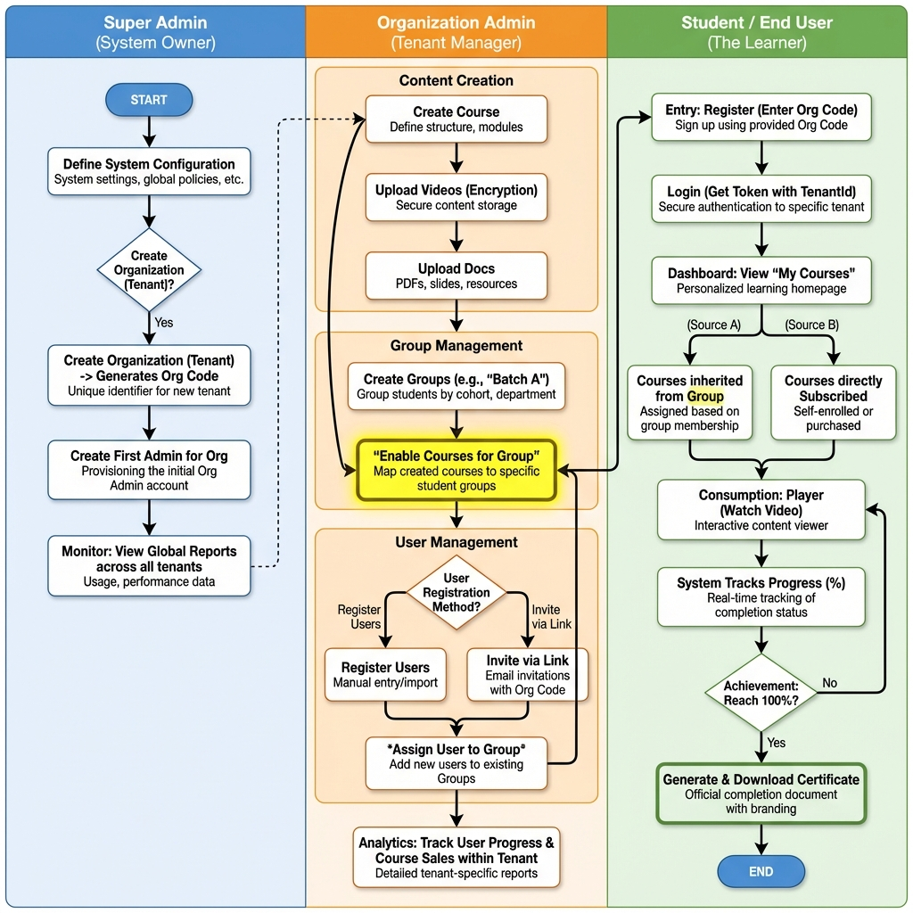

# 📘 LMS Frontend Developer Guide (Multi-Tenant)

**Project:** SoulCode LMS  
**Target Audience:** Frontend Developers (React/Angular/Vue)

---

## 📸 System Flowchart (The Big Picture)

This chart explains the complete lifecycle of the application. Please refer to this for understanding user journeys.



> *Note: If the image above is broken, ensure `LMS_Full_Flow_Diagram.png` is in the same folder as this file.*

---

## 🔐 1. Authentication & Security (Critical)

The system is **Multi-Tenant**. This means a single API serves multiple organizations. The backend determines "Who sees what" based on the **JWT Token**.

### **Rules for Frontend:**
1.  **Login Response:** Store the `token` from `POST /api/Auth/login`.
2.  **API Requests:** EVERY request (except Login/Register) must have this header:
    ```http
    Authorization: Bearer <Your_Stored_Token>
    ```
3.  **Tenant Logic:** You generally **DO NOT** need to send `TenantId` manually in GET/POST requests. The backend extracts it from the Token automatically.

---

## 🚦 2. API Flow by Role

### **Role A: Super Admin**  
*The platform owner (e.g., You).*

| Feature | Action | Endpoint | Payload (JSON) |
| :--- | :--- | :--- | :--- |
| **Setup** | Create Org | `POST /api/Organization` | `{ "Name": "TCS", "Code": "tcs01", "Domain": "lms.tcs.com" }` |
| **Setup** | Create Org Admin | `POST /api/Auth/register` | `{ "Email": "admin@tcs.com", "Role": "Admin", "TenantId": <OrgId> }` |

---

### **Role B: Organization Admin**  
*The manager of a specific company/institute.*

| Feature | Action | Endpoint | Payload (JSON) |
| :--- | :--- | :--- | :--- |
| **Course** | Create Course | `POST /api/Course` | `{ "Title": "Python 101", "Price": 499 }` |
| **Content** | Upload Video | `POST /api/CourseVideo` | *Multipart Form Data (Video File)* |
| **Groups** | Create Group | `POST /api/Groups/create` | `{ "GroupName": "Batch A - 2024" }` |
| **Mapping** | **Enable Course** | `PUT /api/Groups/{id}` | `{ "Courses": [{ "CourseId": 10, "IsEnable": true }] }` <br> *(Critical: Students won't see courses until enabled here)* |
| **Users** | Register Student | `POST /api/Auth/register` | `{ "Email": "student@tcs.com", "TenantId": <Auto_From_Token> }` |
| **Permissions** | Assign Role | `POST /api/UserPermissions/assign-role` | `{ "UserId": 105, "RoleId": 4 }` <br> *Assign "Student" or "Instructor" role.* |
| **Permissions** | Custom Permission | `POST /api/UserPermissions/assign-permissions` | `{ "RoleId": 4, "ModuleId": 1, "PermissionIds": [1, 2] }` <br> *Fine-grain access control.* |

---

### **Role C: Student (End User)**  
*The learner.*

| Feature | Action | Endpoint | Payload (JSON) |
| :--- | :--- | :--- | :--- |
| **Auth** | Public Register | `POST /api/Auth/register` | `{ "Email": "...", "OrganizationCode": "tcs01" }` <br> *OrgCode links them to the right tenant* |
| **Auth** | Login | `POST /api/Auth/login` | `{ "Email": "...", "Password": "..." }` |
| **Dashboard** | **My Courses** | `GET /api/UserCourse/my-courses` | *(No Params) - Backend returns only assigned/purchased courses.* |
| **Learning** | Play Video | `GET /api/CourseVideo/stream/{id}` | *Stream URL for video player* |
| **Progress** | Search Courses | `GET /api/Course/list?isActive=true` | *Global search available to their tenant* |
| **Reward** | Certificate | `GET /api/Certificates/download` | *Download PDF if progress is 100%* |

---

## ⚠️ Helper Configs

### **Organization Code (Public Registration)**
If you are building a "Sign Up" page for public users:
1.  Ask for **Organization Code** (e.g., `soul01`).
2.  Send it in the `RegisterRequest` body: `OrganizationCode: "soul01"`.
3.  If valid, the user becomes a student of that Org. If invalid, API returns `400 Bad Request`.

### **Video Streaming**
The video URL is **protected**. You cannot just put it in an `src` tag directly if it requires headers.
*   **Option 1:** Use a player that supports Auth Headers.
*   **Option 2:** Call the `Stream` API to get a temporary one-time URL (if implemented).
*   **Current Implementation:** The endpoints require Bearer Token.

---

**End of Guide**
