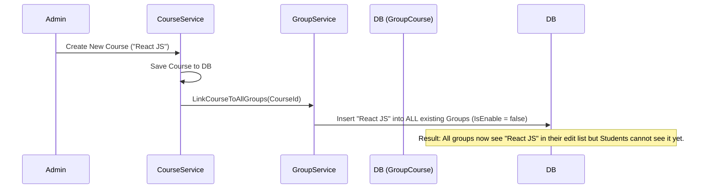
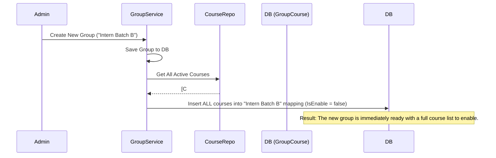
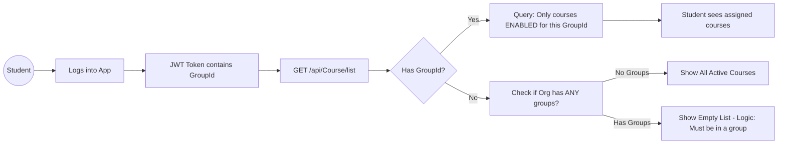

# LMS Groups & Courses: Final Management Flow

This document explains the complete automated flow of how Courses and Groups interact in the LMS.

---

## 1. Automated Linkage Logic (The "Ever-Ready" List)

We use an **Auto-Assignment** strategy so that Admins never have to manually "search and add" courses to groups. Everything is pre-linked in a `Disabled` state.

### A. When a New Course is Created


### B. When a New Group is Created


---

## 2. Admin Management Flow (The "Bulk Update")

Admin decides which students (Groups) see which content.

```mermaid
graph TD
    A[Admin Opens Group Edit Popup] --> B[GET /api/Groups/group-courses/{groupId}]
    B --> C[Display Full Course List with Checkboxes]
    C --> D{Admin Toggles Checkboxes}
    D --> E[Click SAVE Button]
    E --> F[PUT /api/Groups/bulk-update-courses]
    F --> G[Update IsEnable: true/false in DB]
    G --> H[Success: Results visible to Students]
```

---

## 3. Student View Flow (The "End Result")

How the student actually sees the courses in their dashboard.



---

## 4. Summary of Key APIs

| Purpose | Method | Endpoint |
| :--- | :--- | :--- |
| **List Group Courses** | `GET` | `/api/Groups/group-courses/{groupId}` |
| **Update Assignment** | `PUT` | `/api/Groups/bulk-update-courses` |
| **Student Catalog** | `GET` | `/api/Course/list` (Uses GroupId Claim) |

---

## 5. Engineering Benefits
1. **Consistency**: Mapping table is always up-to-date.
2. **Speed**: Filtering is a simple indexed query on `GroupId` and `IsEnable`.
3. **Control**: Admins can prepare courses in "Draft" (Disabled) and launch them organization-wide with single clicks.
